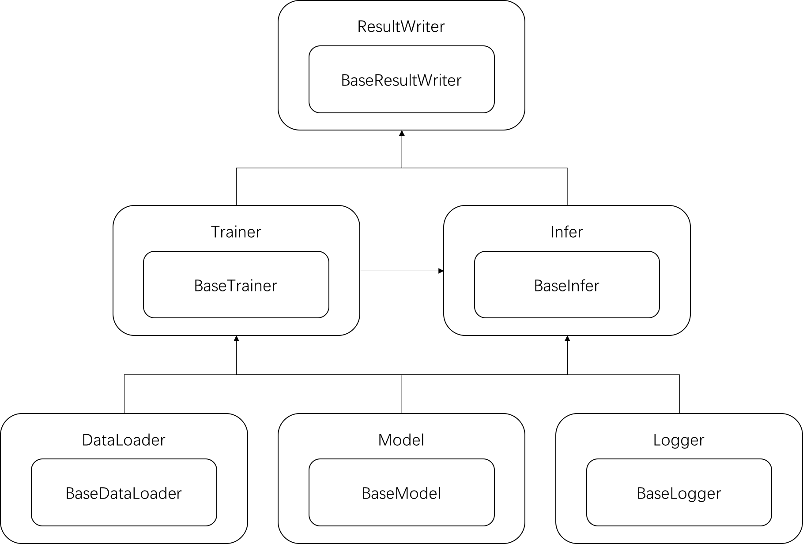

[TOC]

## 快速运行代码

### 方式1(推荐)

在命令行终端中跳转到项目根目录下，运行 `run.sh`：

```shell
sh run.sh
```

脚本会运行命名为 `level1_order.py` 的 Python 文件，并将终端输出打印到日志文件 `logs/level1_order.log`，具体输出内容见相应的日志文件。

### 方式2

在命令行终端中跳转到项目根目录下，直接运行 `level1_order.py` 文件：

```shell
python -c configs/level1_config.json level1_order.py
```

其中，`level1_config.json` 文件中包含运行所需要的配置参数。

**备注：在运行时，必须指定配置文件的路径！**

## 代码结构说明

将代码按照功能进行划分，主要分为 **<u>6</u>** 个部分，分别为数据加载类（`DataLoader`）、模型类（`Logger`）、日志类（`Logger`）、训练类（`Trainer`）、预测/推理类（`Infer`）以及结果写入类（`ResultWriter`），它们之间的层级关系如下图所示，



<center><small><b>图 1：代码框架图</b></small></center>

具体地，**<u>模型类</u>**主要用于搭建深度学习的模型图（graph），对于传统的机器学习算法，则不需要创建模型类；**<u>训练类</u>**用于调试模型的参数，并根据结果对模型进行调整，最终输出调试好的模型；**<u>预测/推理类</u>**则用于加载保存的模型并进行预测；其他的类，诸如**<u>数据加载类</u>**、**<u>日志类</u>**以及**<u>结果写入类</u>**，见名知义。

对应的目录结构如下所示，

```
.
├── LICENSE
├── README.md
├── figs (图片)
├── configs (配置文件)
├── base (基类)
├── data_loader (数据加载类)
├── model (模型类，暂无)
├── trainer (训练类，暂无)
├── infer (推理类)
└── util (日志类和实用工具)
```

## 如何进行代码开发

> 步骤0.1：请注意自己的代码规范！！！
>
> 步骤0.2：请注意自己的代码规范！！！
>
> 步骤0.3：请注意自己的代码规范！！！

- 步骤1：继承**<u>数据加载基类</u>**（`BaseDataLoader`），并开发自定义的数据加载方法

- 步骤2（可选）：如果需要使用 TensorFlow 或者 Keras 构建深度学习模型，继承**<u>模型基类</u>**（`BaseModel`），然后在 `build_model` 方法下搭建自己的计算图
- 步骤3（可选）：继承**<u>模型训练基类</u>**（`BaseTrainer`），并开发相应的方法
- 步骤4：继承**<u>模型预测基类</u>**（`BaseInfer`），并开发相应的预测方法
- 步骤5：继承**<u>结果写入基类</u>**（`BaseResultWriter`），并开发相应的写入方法

## TODO

- 添加 `Logger` 类
- 添加 `ResultWriter` 类
- 开发阶段二预测模型

## 更新日志

- 2019/04/10，完成项目代码结构调整
- 2019/03/22，完成阶段一的代码开发